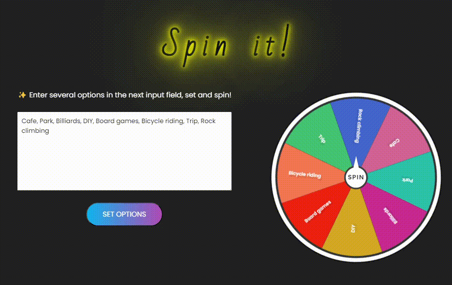

# Roulette

*for difficult choices :)*

<B>Deployment:</B> 
https://rorrian.github.io/SpinWheel/

 

<B>TODO:</B>

- ~~add option to separate options via line break~~
- fix display of text on mobile devices

 

<B>How to improve:</B>

- do "forward spin" when arrow stop between two sections
- display result in a pop-up ?
- redo everything to charts ??? (example: https://codepen.io/harshh9/pen/wvXGXvV)
- make the wheel "draggable" ?
